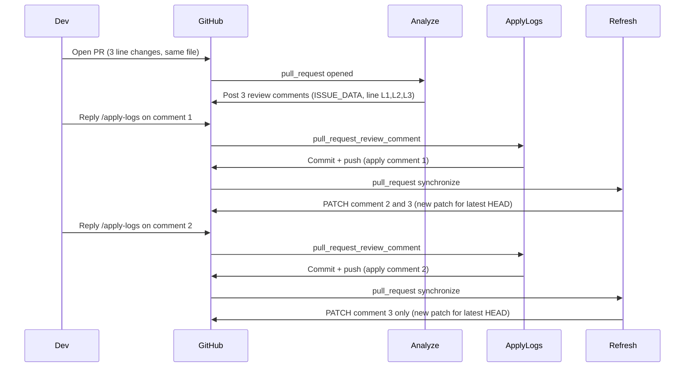

# Test Plan for PR Automation Workflow (analyze + apply-logs + refresh)

## Scope

Validate the flow in [.github/workflows/pr-automation.yml](../.github/workflows/pr-automation.yml): **analyze** (on PR open), **apply-logs** (on `/apply-logs` reply), and **refresh-patches** (on `synchronize` after each apply). The scenario uses one file with 3 changed lines so that the analyzer posts 3 review comments and refresh behavior is deterministic.

## Flow (high level)



## Prerequisites

- Repo: this repo (ai-monitoring) or any repo using this workflow.
- Secrets: `CURSOR_API_KEY` and `GITHUB_TOKEN` (or `git_token`) for apply/refresh.
- To get 3 comments from analyze: make 3 distinct line changes in the **same file** so the analyzer produces 3 issues (e.g. 3 lines that trigger logging suggestions). Use a file the analyzer actually analyzes (e.g. a Python file under `actions/` or `shared/`).
- Comment order: "1st" / "2nd" / "3rd" = by **line number** (or creation order). Refresh only updates comments that are still in **analyzed** state and on files changed in the last commit ([refresh_related_patches.py](../actions/apply-suggested-logs/refresh_related_patches.py) `_get_refresh_candidates` + `is_analyzed_state`).

## Step-by-step test plan

| Step | Action | What to verify |
| ---- | --------------------------------------------------------------------------------------------------------------------------- | -------------------------------------------------------------------------------------------------------------------------------------------------------------------------------------- |
| 1 | Create branch, edit **one file** with **3 line changes** (e.g. add or tweak 3 lines that will trigger logging suggestions). | File has exactly 3 changed lines in the diff. |
| 2 | Push branch and open a PR. | PR is open; branch is the head of the PR. |
| 3 | Wait for workflow run. | **analyze** job runs (trigger: `pull_request` `opened`); no **apply-logs** or **refresh-patches** yet. |
| 4 | Check PR review comments. | There are **3 review comments** from the workflow (bot), each with `ISSUE_DATA`, `Reply with \`/apply-logs`, and on the same file at 3 different lines (L1 < L2 < L3). |
| 5 | Reply to the **1st comment** (lowest line number) with exactly `/apply-logs`. | **apply-logs** job runs; no errors. |
| 6 | Check PR commits and branch. | A **new commit** on the PR branch with the applied change (e.g. "Apply AI-suggested logging improvements" or the commit message from the apply step). Parent comment shows "Applied" (state set by [comment_state.py](../libs/comment_state.py) `set`). |
| 7 | Check other comments after refresh. | **refresh-patches** job ran (trigger: `synchronize`). The **2 other comments** (2nd and 3rd) have **updated ISSUE_DATA** (e.g. new `patch` / `file_hash`) so the patch is based on the new HEAD; visible text can be unchanged. |
| 8 | Reply to the **2nd comment** with `/apply-logs`. | **apply-logs** job runs again; second change is applied. |
| 9 | Check PR commits. | Another **new commit** on the PR with the second applied change. |
| 10 | Check remaining comment after refresh. | **refresh-patches** ran again. **Only the 3rd comment** was refreshed (new patch for latest HEAD). The 1st and 2nd comments are in "applied" state and are not refreshed. |

## Verification details

- **Analyze job**: [pr-automation.yml](../.github/workflows/pr-automation.yml) lines 41–46: runs only when `pull_request` and `opened` or `reopened`, and head repo is the same as workflow repo.
- **Comments**: Each comment has `<!-- ISSUE_DATA: {...} -->` with `file`, `line`, `patch`. Refresh only considers comments that are bot-issue comments and in **analyzed** state ([refresh_related_patches.py](../actions/apply-suggested-logs/refresh_related_patches.py) `is_bot_issue_comment`, `is_analyzed_state`).
- **Refresh**: Runs on `synchronize`; uses `git diff --name-only HEAD~1 HEAD` as changed files; only refreshes comments on those files ([pr-automation.yml](../.github/workflows/pr-automation.yml) "Refresh patches for changed files" step). So after each apply, only comments on the changed file and still "analyzed" get refreshed (2 then 1).

## Test script

The script [tests/test_pr_workflow_apply_refresh.py](test_pr_workflow_apply_refresh.py) automates setup (optional), assertions, and optional cleanup.

### Usage

- **Full test** (no PR yet): create branch, add a sample file with code that lacks logging (so the analyzer suggests fixes), push, open PR, then run all assertions. This is the default when you don't pass `--pr-number`:
  ```bash
  export GITHUB_TOKEN=...
  python tests/test_pr_workflow_apply_refresh.py
  ```
- **Assertions only** (PR already open with 3 analyze comments):
  ```bash
  export GITHUB_TOKEN=...
  python tests/test_pr_workflow_apply_refresh.py --pr-number 123
  ```
- **With cleanup**: close PR and delete branch when done:
  ```bash
  python tests/test_pr_workflow_apply_refresh.py --cleanup
  ```
  Or after using an existing PR: `--pr-number 123 --cleanup`

### Script responsibilities

- **Setup (optional)**: Create branch from main, add `tests/test_wf_analyzer_sample.py` (code without logging so the analyzer suggests fixes), commit, push, open PR via `gh pr create` (requires `gh` CLI and auth).
- **Assertions**: Poll for **analyze** run completion; list PR review comments and assert ≥ 3 bot ISSUE_DATA comments sorted by line (1st/2nd/3rd); reply `/apply-logs` to 1st comment; poll **apply-logs** then **refresh-patches**; assert new commit, 1st comment "Applied", 2nd and 3rd ISSUE_DATA updated; reply `/apply-logs` to 2nd comment; poll again; assert one more commit, 2nd "Applied", only 3rd ISSUE_DATA updated.
- **Cleanup (optional)**: Close PR and delete branch via `gh pr close` and `git push origin --delete`.

## Summary

- **Scenario**: 1 PR, 1 file, 3 line changes → 3 analyze comments → apply 1st → commit + refresh 2nd & 3rd → apply 2nd → commit + refresh 3rd only.
- **Test plan**: 10 steps with clear actions and verification (analyze run, 3 comments, 2 apply rounds, commit count, and which comments get refreshed).
- **Test script**: Automate branch/PR creation (optional), then automate: wait for analyze, check 3 comments, reply /apply-logs twice, wait for apply-logs and refresh-patches, and assert commits and ISSUE_DATA updates.
